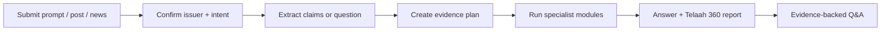

# PRD — Telaah 360

**Version:** 2.1  
**Track:** AI Agents & Assistants  
**Positioning:** Asisten riset emiten yang memahami prompt, postingan pasar, dan berita dengan data Sectors.

## 1. Product Vision

Telaah 360 menerima apa pun yang ingin pengguna pahami tentang satu emiten IDX: postingan investor/broker, potongan berita, headline dan ringkasannya, opini pasar, atau pertanyaan biasa dalam bahasa alami. Telaah mengubah input tersebut menjadi laporan perusahaan yang utuh dan dapat diaudit. Pengguna tidak hanya mengetahui apakah sebuah klaim benar, tetapi memahami kondisi bisnis, valuasi, kepemilikan, flow broker, harga-momentum, dan peristiwa korporasi di belakangnya.

> Masukkan satu prompt, postingan, atau berita tentang satu emiten; Telaah menjawab pertanyaan pengguna sekaligus menunjukkan fakta, konteks, dan keterbatasan yang relevan untuk riset lanjutan.

Telaah bersifat informasi dan edukasi. Produk tidak memberi rekomendasi beli/jual, target harga, prediksi harga, atau eksekusi perdagangan.

## 2. Product Boundary

### Input

- Satu **primary issuer** per report, agar bukti dan periodenya tetap konsisten.
- Input bahasa alami hingga 6.000 karakter: postingan, berita/potongan berita, opini, atau pertanyaan langsung; maksimum 10 klaim atomik jika input berisi klaim.
- Ticker dideteksi dari teks atau dipilih pengguna; ketidakjelasan harus dikonfirmasi.
- URL postingan/berita dapat disimpan sebagai metadata sumber. User tetap memasukkan teks/headline/excerpt yang ingin ditelaah; MVP tidak melakukan scraping otomatis.

### Analysis modes

| Mode | Tujuan | Perilaku |
|---|---|---|
| **Quick Check** | Memeriksa klaim inti secepat mungkin. | Menjalankan hanya modul yang dipicu oleh klaim. |
| **Full Company Review** | Menjawab “bagaimana kondisi sebenarnya emiten ini?” | Menjalankan semua modul yang datanya valid dan tersedia. |

### Input intent routing

| Jenis input | Contoh | Respons utama Telaah |
|---|---|---|
| Klaim/postingan pasar | “Broker asing masuk, berarti ABCD akan naik.” | Pecah klaim, verifikasi fakta, lalu berikan konteks emiten. |
| Berita atau disclosure | “ABCD mengumumkan rights issue. Dampaknya apa?” | Jelaskan peristiwa, tampilkan timeline/corporate data, kondisi perusahaan, dan hal yang belum dapat disimpulkan. |
| Pertanyaan langsung | “Bagaimana kondisi fundamental dan valuasi ABCD?” | Jawaban langsung diikuti Full Company Review yang relevan. |
| Opini/investment thesis | “Saya rasa bisnis ABCD mulai pulih.” | Pisahkan hipotesis dari fakta, uji indikator pendukung dan yang berlawanan. |
| Pertanyaan teknikal/flow | “Apakah volume dan broker flow ABCD mendukung kenaikan terakhir?” | Tampilkan price-volume, technical, dan broker-flow context pada periode eksplisit. |

## 3. Expanded Scope

| Modul | Isi laporan | Data utama |
|---|---|---|
| Claim Intelligence | Klaim atomik, verdict, definisi metrik, periode, confidence, dan limitation. | Semua sumber yang relevan. |
| Business & Financial Health | Revenue, net income, margins, pertumbuhan, serta cash/debt/operating metrics yang valid untuk sektor. | Company report dan quarterly financials. |
| Valuation & Peer Lens | Market cap dan multiple tersedia (P/E, P/B, P/S, dividend); perbandingan hingga 5 peer yang benar-benar comparable. | Screener, company report, taxonomy sector. |
| Ownership & Corporate Profile | Identitas bisnis, sektor, shareholder composition, free float bila tersedia. | Company/ownership/free-float data. |
| FlowLens — Broker & Foreign Flow | 5–14 hari broker buy/sell/net, lots, frequency, weighted average price, origin/cohort, top buyer/seller, foreign flow bila tersedia. | Broker activity, registry, foreign-flow. |
| Price, Volume & Technical | Return, SMA20/50, EMA5, MACD, RSI, relative volume, chart historis. | Daily close/volume hingga 90 hari. |
| Events & Disclosure Timeline | Corporate action, insider/major-shareholder filing, suspensions, dan news/relevant disclosure. | Corporate action, filing, suspension, news. |
| Report Q&A | Pertanyaan lanjutan seperti “kenapa margin turun?” dari bukti pada report. | Evidence report; tool baru hanya bila memang diperlukan. |

Setiap modul memiliki status `available`, `partial`, `unavailable`, atau `not_applicable`. Tidak ada data yang digantikan angka nol atau narasi perkiraan.

### Still out of scope

- Running trade, order book, data intraday, parent-order reconstruction, broker switching/fingerprinting.
- Klaim bandar, beneficial owner, koordinasi, manipulasi, atau niat broker.
- Crawling sosial otomatis dan OCR.
- Unlimited universe scan; Peer Lens dibatasi 5 peer dengan basis perbandingan jelas.

## 4. User Workflow

1. User menulis prompt, menempel postingan/berita, memilih Quick Check atau Full Company Review, lalu mengonfirmasi emiten.
2. Input & Intent Interpreter mengklasifikasikan permintaan sebagai claim check, news/event explanation, company overview, thesis review, atau market/technical question; lalu memisahkan fakta, interpretasi, opini, prediksi, metrik, dan periode bila ada.
3. Coordinator menyusun **Evidence Plan**: modul, parameter, batas kredit, dan urutan eksekusi.
4. Specialist modules mengambil/menormalisasi data; seluruh kalkulasi angka dilakukan oleh kode.
5. Claim Evaluator memberi verdict tiap klaim.
6. Synthesis Guard menjawab pertanyaan pengguna terlebih dahulu, lalu menyusun report yang mengikat setiap angka ke evidence dan menolak financial-advice language.
7. User membuka bukti atau mengajukan pertanyaan lanjutan dalam konteks report.

## 5. Custom Agent Orchestration

| Task | Output tervalidasi |
|---|---|
| Input & Intent Interpreter | `InputIntent`, `AtomicClaim[]` bila ada, candidate issuer, ambiguity. |
| Coordinator | `AnalysisPlan`, tool/credit/time budget. |
| Financial Analyst | Financial and valuation module results. |
| Market & Flow Analyst | Broker, foreign flow and market context. |
| Technical Analyst | Deterministic indicator context. |
| Events Analyst | Chronological disclosure/event module. |
| Synthesis & Citation Guard | `CompanyIntelligenceReport`. |

Specialist calls berjalan paralel hanya setelah plan terkunci. LLM menjelaskan data terstruktur; LLM tidak menghitung atau membuat angka.

## 6. Claim Framework and Trust Rules

| Verdict | Meaning |
|---|---|
| Didukung | Bukti dan periode sesuai klaim faktual. |
| Bertentangan | Bukti secara material berbeda dari klaim. |
| Perlu konteks | Fakta mungkin benar, tetapi kesimpulan luas tidak terbukti. |
| Tidak dapat diverifikasi | Metrik/periode/pembanding/data tidak memadai. |
| Opini/prediksi | Tidak dapat diuji sebagai fakta historis. |

- Semua kalimat majemuk diatomisasi.
- Pertumbuhan, margin, return, multiple transformation, SMA/EMA/MACD/RSI, volume dan flow feature dihitung deterministik.
- Nilai quarterly, cumulative, annual, restated, unit dan currency tidak boleh dicampur.
- Peer comparison dirender hanya ketika price date, earnings basis, metric definition dan peer universe kompatibel.
- Cohort/origin broker adalah metadata penyedia data—bukan identitas investor.
- Setiap angka pada ringkasan memiliki `evidence_id`, period, `data_as_of`, dan `retrieved_at`.

## 7. Report Structure

1. Direct Answer — tanggapan ringkas terhadap prompt/berita/postingan dan data freshness.
2. Post Claim Check.
3. Business & Financial Health.
4. Valuation & Peer Lens.
5. Ownership & Corporate Profile.
6. FlowLens: Broker & Foreign Flow Context.
7. Price, Volume & Technical Context.
8. Events & Disclosure Timeline.
9. Open Questions / limitations.
10. Evidence & Methodology.

Fundamental dan technical selalu menampilkan horizon waktunya secara terpisah; satu tidak dianggap membuktikan yang lain.

## 8. Functional Requirements

| ID | Requirement | Priority | Acceptance criterion |
|---|---|---|---|
| FR-01 | Flexible input, source metadata, issuer confirmation | Must | Accept prompt/post/news text; one primary issuer is resolved or clarification is requested. |
| FR-02 | Intent classification | Must | Classifies claim, news/event, overview, thesis, or technical/flow query and exposes selected route. |
| FR-03 | Quick/Full mode | Must | Quick routes minimal tools; Full progressively renders every valid module. |
| FR-04 | Atomic claim and plan | Must | Up to 10 typed claims when present plus persisted evidence plan/tool trace. |
| FR-05 | Financial Health | Must | Period-safe revenue, income, margins and valid supporting metrics. |
| FR-06 | FlowLens context | Must | Broker aggregates/metadata with explicit non-ownership limitation. |
| FR-07 | Technical context | Must | SMA20/50, EMA5, MACD, RSI, volume and warm-up state. |
| FR-08 | Valuation/Peer Lens | Should | ≤5 validated peers; comparison disabled if incompatible. |
| FR-09 | Ownership/Profile | Should | Available profile, shareholder/free-float data and gaps. |
| FR-10 | Events timeline | Should | Corporate actions, filings, suspension/news in date order. |
| FR-11 | Evidence Drawer | Must | Raw values, formulas, endpoint, parameters, timestamps, rules/model version. |
| FR-12 | Report Q&A | Should | Evidence-grounded follow-up; refuses advice/prediction requests. |
| FR-13 | Save/share report | Could | Read-only report after data/privacy guard. |

## 9. Performance, Safety and Data Discipline

| Metric | Target |
|---|---:|
| Quick Check p95 | <60 seconds |
| Full Company Review p95 | <90 seconds with progressive loading |
| Max full-review tool calls | 30 with plan stop condition |
| Numerical evidence coverage | 100% |
| Unsafe advice/ownership claim rate | 0% |
| End-to-end demo completion | ≥90% |

API keys remain server-side. Each analysis captures request ID, sanitised input, tool trace, snapshot metadata, model/prompt/rule version, latency and failure class. Partial reports are valid only when missing data is visible.

## 10. Four-Person Delivery Model

| Owner | Owns | Key deliverable |
|---|---|---|
| P1 — Product/Agent/Integration | Contracts, coordinator, lifecycle, report Q&A, release. | Post → evidence plan → progressive report. |
| P2 — Financial/Quant | Financial, valuation/peer rules, technical engine. | Validated Financial/Valuation/Technical modules. |
| P3 — Flow/Events/Data | FlowLens, ownership, filing/action/news adapters. | Normalized flow, ownership and event evidence. |
| P4 — Frontend/QA/Story | Full-report UX, evidence drawer, E2E/evaluation/safety/demo. | Complete report UI and frozen test/demo pack. |

## 11. Delivery Roadmap

| Phase | Integrated outcome |
|---|---|
| 0. Data proof | Endpoint/field/credit coverage matrix plus sanitised fixtures. |
| 1. Trust slice | One post → claim check → financial + technical evidence report. |
| 2. 360 expansion | FlowLens, ownership and events in Full Review. |
| 3. Context expansion | Validated peer lens and report-scoped Q&A. |
| 4. Submission | Frozen 40-claim evaluation set, clean-environment rehearsals, README/video. |

If time becomes constrained, preserve all completed evidence modules and defer only save/share. Do not drop formula/period validation or safety safeguards.

## 12. Definition of Done

- Both modes work for verified supported issuers.
- Full Company Review renders every available module and explains partial/unavailable modules.
- At least 40 scenarios cover claim posts, news/event inputs, direct company questions, investment theses, technical/flow questions, fundamental, valuation, event and mixed cases.
- Calculations/reports are reproducible from evidence metadata.
- Team completes two clean-environment demo rehearsals and documents all data boundaries.
